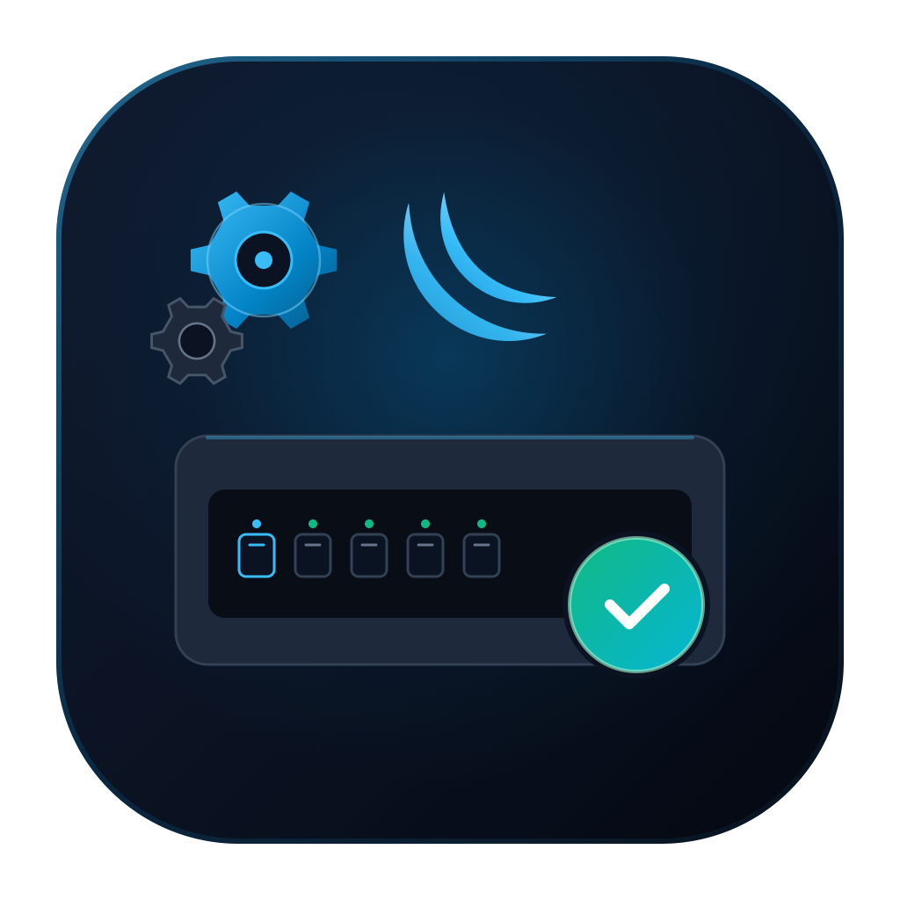

<h1 align="center">
  <br>
  MikroTik RIF Viewer
</h1>

<p align="center">
  An offline desktop viewer for MikroTik RouterOS support captures (<code>supout.rif</code>).
</p>

<p align="center">
  <a href="https://github.com/balakar94/mikrotik-rif/actions/workflows/ci.yml"></a>
  <a href="LICENSE"></a>
</p>

Open a capture and read every module it contains — configuration, logs,
interfaces and more — in a fast, native window. Everything runs locally: there
is no backend, no upload step, and no network code anywhere in the product.

- **Product name:** MikroTik RIF Viewer
- **Package / binary:** `mikrotik-rif`
- **Stack:** Rust (edition 2024) · [eframe/egui](https://github.com/emilk/egui) 0.36
- **License:** [MIT](LICENSE)

## Highlights

- **Offline by construction.** The parser is UI-agnostic and free of filesystem
  access; the app never opens a socket and never writes to disk unless you ask
  it to export a module.
- **Cheap to open, cheap to read.** Indexing transcodes just enough of each part
  to learn its label and keeps the payload compressed. A single part is inflated
  on demand, so peak memory tracks the open module, not the whole file.
- **Responsive on huge captures.** Reading, indexing and decompression run on a
  background worker thread; the module list and the text view are virtualized,
  so a module with hundreds of thousands of lines scrolls smoothly.
- **Honest about damage.** A part that cannot be indexed is still listed and
  marked, instead of being silently dropped.
- **Follows your system.** Light/dark theme and interface language are detected
  from the OS and can be overridden per run.
- **Seven languages** out of the box, with the base locale and English fallback
  always available.

## Platform support

| OS | Pre-built binaries | Notes |
| --- | --- | --- |
| **macOS** | Apple Silicon (arm64) only | Intel Macs are **not** shipped. Build from source on Intel. |
| **Windows** | x86_64 and arm64 | `.msi` on x64; `-setup.exe` on x64 and arm64. |
| **Linux** | x86_64 and arm64 | `.deb`, `.rpm` and `.AppImage`. |

The release workflow builds on **native** x86_64 and arm64 GitHub runners, so
there is no cross-compiling and no 32-bit target. Every package name embeds its
architecture (`_x64`/`_arm64`, `_amd64`/`_arm64`, `_x86_64`/`_aarch64`), so both
variants can be attached to the same release. Any other architecture is welcome
to build from source — the only requirement is a Rust toolchain supported by
eframe.

## Install

Pre-built installers are attached to every tagged release:

| Platform | Package | First-launch note |
| --- | --- | --- |
| macOS (Apple Silicon) | `.dmg` with the `.app` inside | Unsigned, so Gatekeeper may block it: right-click the app → **Open**, or run `xattr -dr com.apple.quarantine "/Applications/MikroTik RIF Viewer.app"`. |
| Windows (x64 / arm64) | `.msi` (WiX, x64) and `-setup.exe` (NSIS, x64 + arm64) | Unsigned, so SmartScreen may warn: **More info → Run anyway**. |
| Linux (x64 / arm64) | `.deb`, `.rpm`, `.AppImage` | Installs a menu entry and icon under `/usr/share/applications` and the hicolor theme. |

```sh
sudo apt install ./mikrotik-rif_*_amd64.deb        # Debian/Ubuntu, x64
sudo apt install ./mikrotik-rif_*_arm64.deb        # Debian/Ubuntu, arm64
sudo dnf install ./mikrotik-rif-*.rpm               # Fedora/RHEL, either arch
chmod +x MikroTik_RIF_*.AppImage && ./MikroTik_RIF_*.AppImage
```

Builds are intentionally unsigned for now: signing and notarization need paid
Apple and Windows certificates, and can be added later through CI secrets
without changing the pipeline.

## Using the app

The shell moves through four stages:

1. **Welcome.** The product name, a small diagram of the workflow (router →
   capture → technician) and a single **Start** action.
2. **Home.** Drag your `supout.rif` anywhere onto the window, or click the drop
   target to pick a file.
3. **Opening.** While the capture is read and indexed, a page stack fans open
   under a magnifying glass. The animation is driven by the real byte-read
   progress and then fades into the workspace.
4. **Workspace.** A **Modules** rail on the left with a name filter, and the
   decoded output of the selected module on the right.

In the workspace:

- The rail can be collapsed from the panel button in the top bar, giving the
  text the full width.
- Modules with the same label are disambiguated as `· copy 2`, `· copy 3`, and
  unreadable modules are listed in the alert colour.
- **Line numbers** toggles the gutter.
- The **magnifier** button opens in-module search; matches are highlighted and
  counted, with previous/next navigation. Pressing Enter jumps to the next
  match, Shift+Enter to the previous one, and Esc closes the bar.
- **Copy** puts the open module on the clipboard; **Save as…** writes it to a
  text file.

Keyboard shortcuts (Command on macOS, Control elsewhere):

| Shortcut | Action |
| --- | --- |
| `Cmd/Ctrl+O` | Open a capture |
| `Cmd/Ctrl+S` | Save the open module as… |
| `Cmd/Ctrl+F` | Search in the open module |
| `Esc` | Close the search bar |

## Languages

The interface ships in **English** (base locale) plus German, Spanish, French,
Latvian, Russian and Simplified Chinese:

| Locale | File |
| --- | --- |
| English (base) | `locales/en/mikrotik-rif.ftl` |
| German | `locales/de/mikrotik-rif.ftl` |
| Spanish | `locales/es/mikrotik-rif.ftl` |
| French | `locales/fr/mikrotik-rif.ftl` |
| Latvian | `locales/lv/mikrotik-rif.ftl` |
| Russian | `locales/ru/mikrotik-rif.ftl` |
| Chinese (Simplified) | `locales/zh/mikrotik-rif.ftl` |

The system locale is matched on its base language; anything not shipped falls
back to English, and any identifier a translation is missing falls back to the
English string. Set `MIKROTIK_RIF_LANG` to force a locale for one run:

```sh
MIKROTIK_RIF_LANG=de cargo run -- supout.rif
```

Adding a language is just dropping a `locales/<tag>/mikrotik-rif.ftl` file: the
build script discovers it and embeds it at compile time, with no registry to
update by hand. A test asserts that every shipped locale defines exactly the
same identifiers as the base file.

## Requirements

- Rust 1.85 or newer (edition 2024).
- A Vulkan/Metal/DX12-capable GPU for the default eframe `wgpu` renderer.
- No runtime dependencies beyond the bundled fonts. On Linux, a desktop with
  X11 or Wayland.

## Build from source

```sh
cargo run                  # launch the app
cargo run -- supout.rif    # open a capture straight away
cargo build --release      # optimized binary in target/release/mikrotik-rif
```

Quality gates, the same ones CI runs:

```sh
cargo fmt --all --check
cargo clippy --all-targets -- -D warnings
cargo test
```

The icon assets can be regenerated with `python3 tools/make_icon.py` (needs
Pillow; uses `iconutil` on macOS).

## Capture format

A capture is a text container. Each part is delimited by
`--BEGIN ROUTEROS SUPOUT SECTION` and `--END ROUTEROS SUPOUT SECTION` lines. The
body between them uses a base64-family alphabet (`A–Z a–z 0–9 + / =`) with an
unusual packing: each group of four symbols is read as a little-endian base-64
number and emitted least-significant byte first. The decoded bytes are a
NUL-terminated part label followed by a zlib stream.

The reader indexes labels only and inflates a single part on demand, under
configurable budgets:

| Limit | Default |
| --- | --- |
| Parts per capture | 100 000 |
| Raw part body | 128 MiB |
| Decompressed part | 256 MiB |
| Container line length | 64 MiB |

No real capture is committed to this repository: captures can carry sensitive
router configuration, so the tests build synthetic captures in memory.

## Layout

```
Cargo.toml
LICENSE
.github/workflows/   CI and the tag-triggered release pipeline
docs/RELEASE.md      release engineering and verified prerequisites
src/
  main.rs            entry point and module wiring
  app.rs             stages, workspace, search and interaction
  splash.rs          welcome, home and the opening animation
  theme.rs           light/dark palettes, background gradient, fonts
  icons.rs           vector icons drawn with the painter
  i18n.rs            Fluent loading, OS detection, fallback chain
  worker.rs          background reading, indexing and decoding
  parser/            capture format reader (codec, scanner, deflate, capture, limits, error)
locales/<tag>/mikrotik-rif.ftl
assets/fonts/        bundled Inter, JetBrains Mono and Noto Sans SC (OFL)
assets/icon/         application icon (PNG / ICNS / ICO)
assets/linux/        freedesktop entry and 512 px icon for the Linux packages
tools/make_icon.py   regenerates the icon assets
dist/                generated installers (git-ignored)
```

## Fonts

The interface bundles three fonts, all under the
[SIL Open Font License](https://openfontlicense.org/):

- [Inter](https://rsms.me/inter/) for the interface,
- [JetBrains Mono](https://www.jetbrains.com/lp/mono/) for capture text,
- [Noto Sans SC](https://fonts.google.com/noto/specimen/Noto+Sans+SC) as the CJK
  fallback, so Chinese (and any CJK content inside a capture) renders without
  relying on system fonts.

egui does not use system fonts, so every glyph the interface can show has to be
bundled. Inter covers Latin and Cyrillic; anything else falls through to Noto.
Each bundled font keeps its OFL text next to it in the source tree
(`assets/fonts/OFL-Inter.txt`, `OFL-JetBrainsMono.txt`, `OFL-NotoSansSC.txt`).
The Linux packages also install all three under
`/usr/share/licenses/mikrotik-rif/`, and every GitHub Release attaches them.

Because the fonts are embedded, the release binary is around 19 MB, most of it
the CJK font.

## Releasing

The release workflow is triggered by pushing a version tag:

```sh
git tag -a v0.1.0 -m "v0.1.0"
git push origin v0.1.0
```

It builds the installers on native runners, computes `SHA256SUMS.txt` and
publishes a GitHub Release. A manual `workflow_dispatch` run builds the
artifacts without publishing. The full procedure, the verified packaging
prerequisites and the rollback steps live in [`docs/RELEASE.md`](docs/RELEASE.md).

## License

Released under the [MIT License](LICENSE). You are free to use, modify and
redistribute it, provided the copyright notice and permission notice are kept.

## Trademarks

This is an independent tool and is **not affiliated with, endorsed by or
sponsored by MikroTik**. "MikroTik" and "RouterOS" are trademarks of their
respective owner and are used here only to describe interoperability. The
router glyph in the application icon and on the welcome screen is a generic
access-point drawing, not the MikroTik logo.
